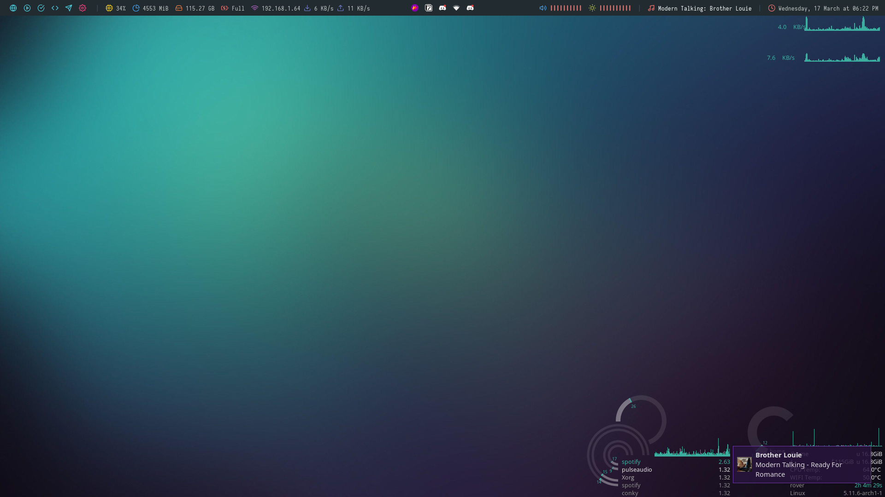
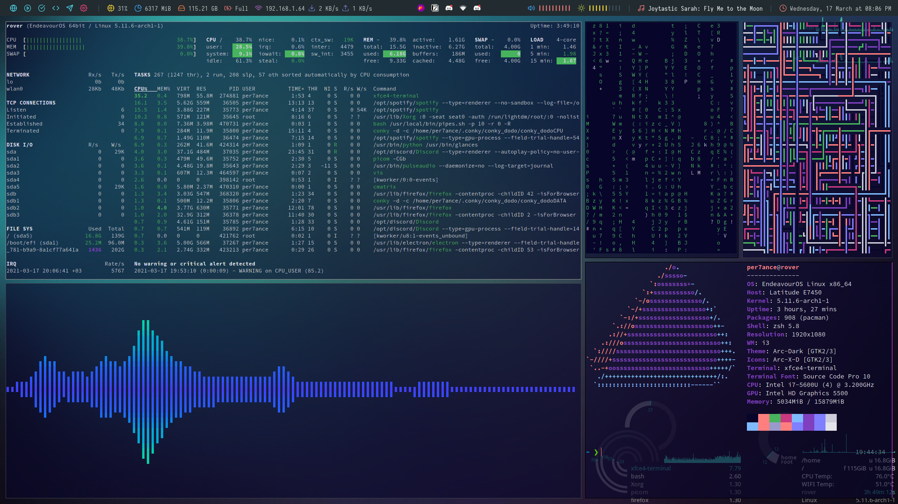
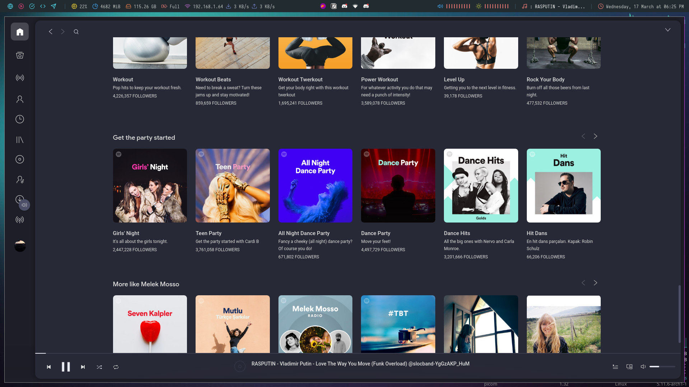
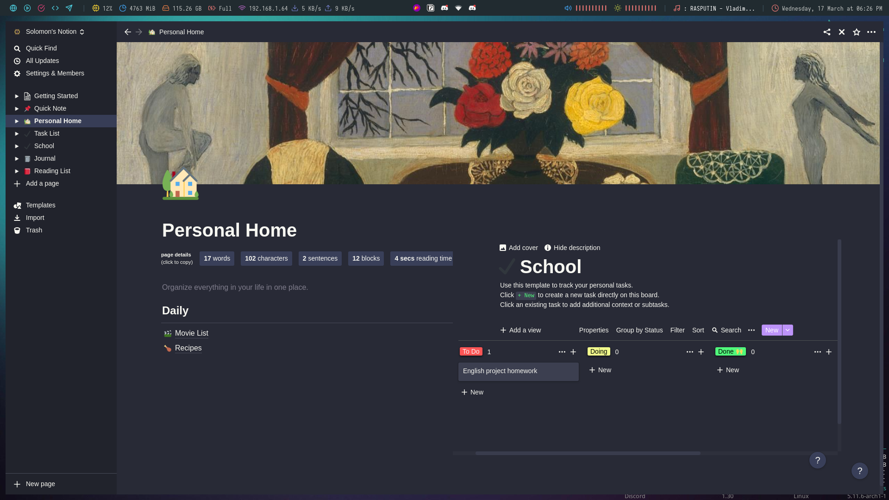
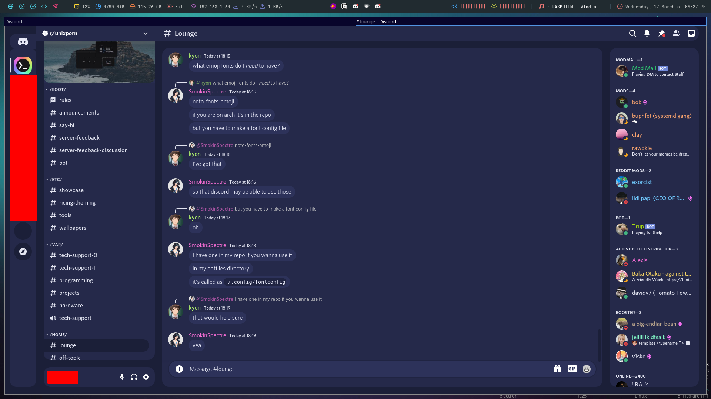

# dotfiles
The configuration files I use. Star the repo if you liked :)

# Screenshots

 
 

Coming soon in the next commit.
 
 

# Info
- OS: Arch Linux ([EndeavourOS](https://endeavouros.com/))
- Kernel: linux (not lts or zen)
- WM: i3-gaps
- DM: lightdm
- Bar: Polybar with edited [polybar-themes/forest](https://github.com/adi1090x/polybar-themes) theme
- GTK: Arc-Dark
- Icons: Arc-X-D
- Cursor: Capitaine Cursors - White
- Font: Noto Sans 11
- Terminal: Xfce4-terminal
    - Shell: zsh with powerline10k theme
- Browser: Firefox
    - Theme: FlyingFox
    - Startpage: Square Start Page extension
    - More info at mozilla folder.
- Music: Spotify with Dribblish/Dracula theme patched via spicetify
- FM: Thunar
- Fetch: neofetch
- Widgets: Conky with edited [conky_dodo](https://github.com/notdodo/conky_dodo) config
- Menus: Rofi
- Notifications: Dunst
- Compositor: picom
 

# IMPORTANT
- Most of the config files are not mine, I mixed-up and edited according to my taste but I credited most of them in the repo.
- These are the configs files I use. You may need to install the required software to make the same theme like me.
- If you have problems/questions create an issue and I'll try to answer if I can.
- You need to configure some paths in the files. After you clone the repo, start a terminal in the repo folder and run ``grep -r per7ance .`` to find the files which you need to replace. When you run this command it will show you the paths which you need to replace per7ance with your own username.
- Polybar can produce errors, if the bar is not like mine then run ``bash ~/.config/polybar/launch.sh --forest`` to check if there is errors. If there is errors then you may need to edit sound cards, backlight config, install spotifyctl. You need to inspect and edit the sections in ``~/.config/polybar/forest`` by following the comment guides.
- Polybar, sometimes it glitches and hides workspaces section. Restart it via ``bash ~/.config/polybar/launch.sh --forest`` command.
- Widgets. If you have problems with widgets, you can edit files in .conky folder.

# Check these dots too
- [Barbarossa93/Genome](https://github.com/Barbarossa93/Genome)
- [TxGVNN/i3-config](https://github.com/TxGVNN/i3-config)
- [FilipeMCruz/dotfiles](https://github.com/FilipeMCruz/dotfiles)