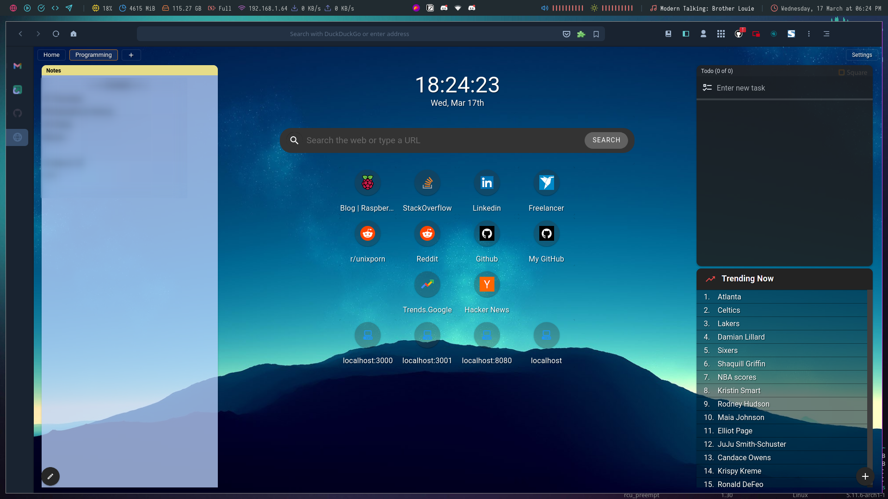

# Mozilla Firefox Config Guide

## Screenshot

 
 
Hello! Because of I do not own the Firefox theme 
and don't want to share the extension files, I wanted 
to create guide instead of sharing my whole profile 
folder. Disadvantage of this is you need to install 
these single by single.
 

## Startpage/Homepage
I use Square Start Page extension for my homepage.
 

## Theme
[FlyingFox](https://github.com/akshat46/FlyingFox)
 

[FlyingFox's Installation Guide](https://github.com/akshat46/FlyingFox/wiki/%23-Installation)
 

## Extensions
- Adblocker for YouTube
- Cookie Popup Blocker
- Ctrl+Number to switch tabs
- DuckDuckGo Privacy Essentials
- Facebook Container
- Flagfox
- HTTPS Everywhere
- Night Eye - Dark Mode on any website (see the Notes section at the bottom)
- Notifier for GitHub
- Privacy Badger
- React Context DevTool
- Redux DevTools
- Simple Tab Groups
- Simple Translate
- Square Start Page
- Svelte Devtools
- Take Webpage Screenshots Entirely - FireShot
- Tree Style Tab (see the Notes section at the bottom)
- Trocker
- uBlock Origin
- Universal Bypass
- Vue.js devtools
- Wide GitHub
- Windowed - floating Youtube/every website
- You No Cards
 

# Notes
- Yeah, I care about privacy
- NightEye extension is different from others and analyzes site and if website is already dark, it disables itself. (Like magic right?)
- If you want the Tree Style Tab to have a theme like mine, you need to check the Theme section at the above. It's theme guide is on FlyingFox's Wiki page.
- Trocker extension is awesome and works similar to PixelBlock.
