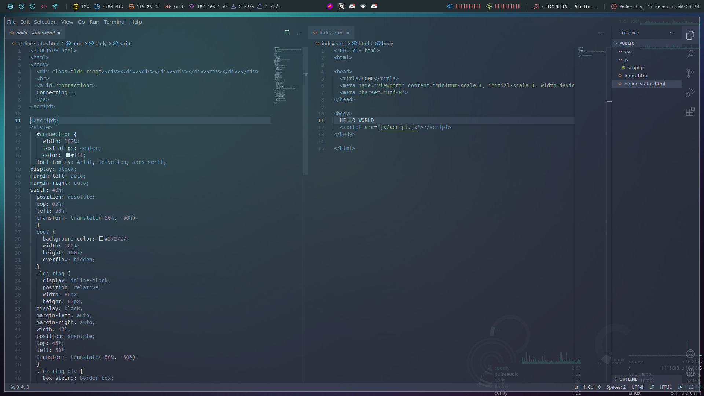

# VSCode Configuration Guide

## Screenshot

 
 
Hello! I wanted to put a readme file only for vscode, 
because I don't want to leak my private information. 
If you want to have the same settings with me I'll 
show you how at below.
 

# Theme
Nord (arcticicestudio.nord-visual-studio-code)
 
Type ``arcticicestudio.nord-visual-studio-code`` in Extension search section.
 

# Extensions
- Bebeardedbear.beardedtheme
- hookyqr.beautify
- nowsci.glassit-linux
- arcticicestudio.nord-visual-studio-code
- chad.nord-operator-theme
 

### I know extensions section is not so long, because I wanted to reset all my extensions a few days ago. I wanted to reset because I had over 200 extensions installed so wanted to install only necessary ones with new start.